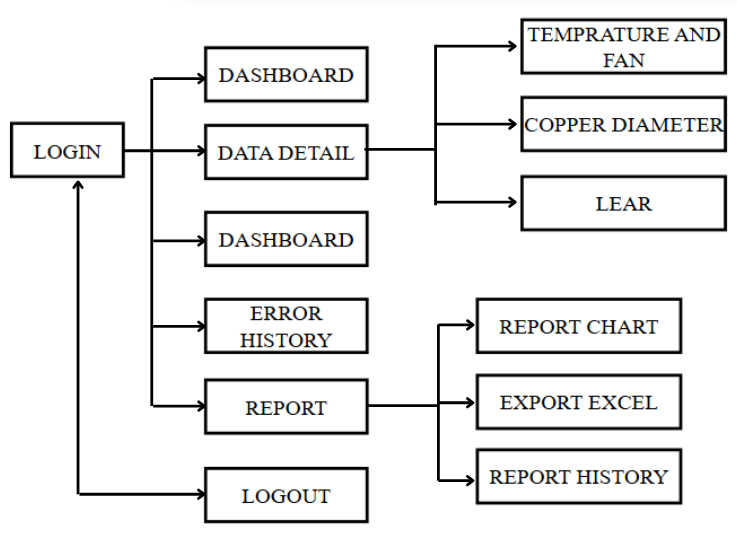
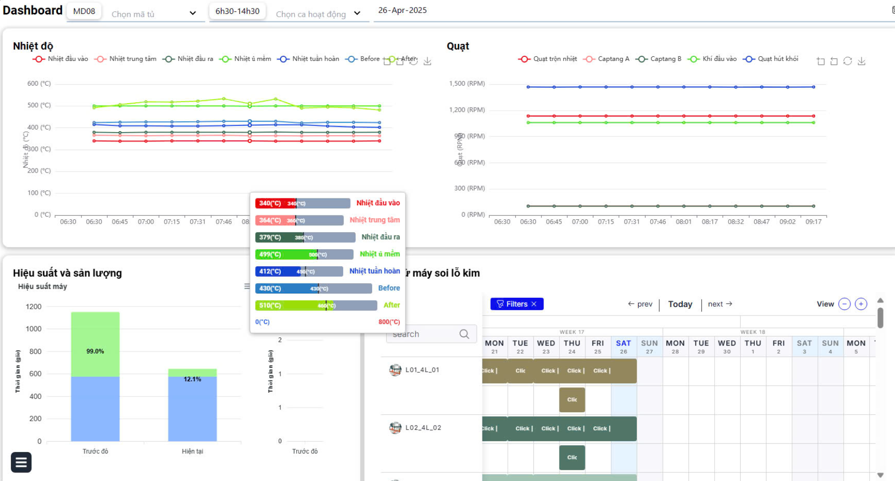
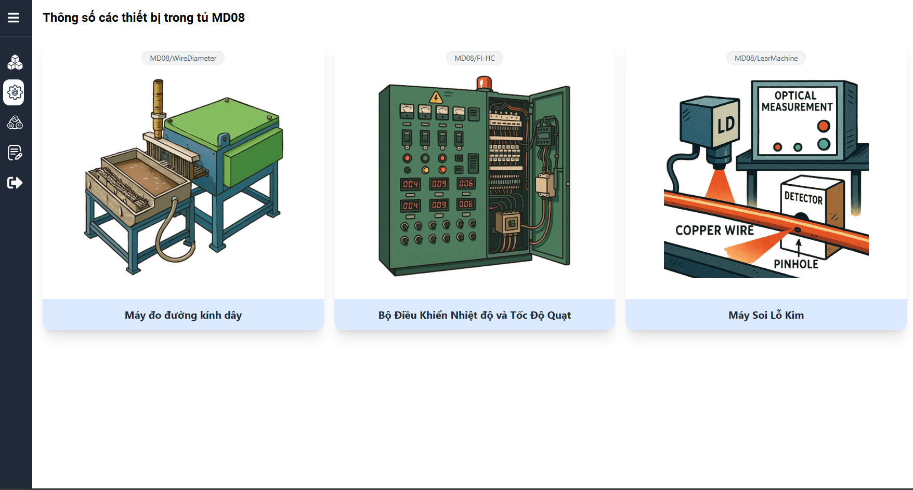
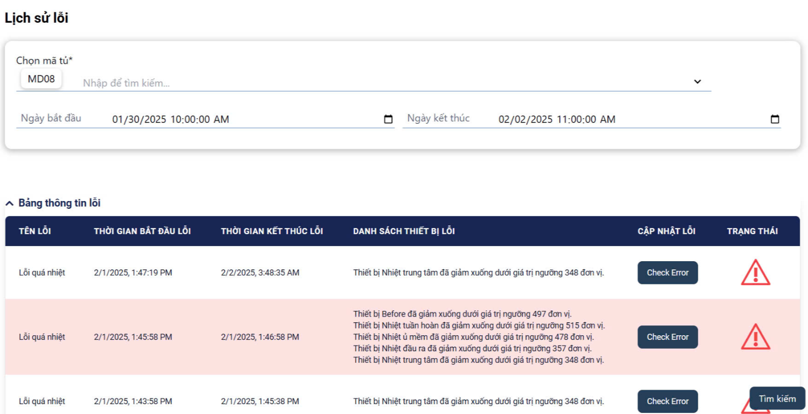

Ứng dụng web gồm **5 trang chính**, hỗ trợ giám sát và quản lý dây chuyền sản xuất trong nhà máy.  
Hiện tại hệ thống đang hoạt động và tiếp tục được phát triển tại:  
👉 [http://45.117.177.157:88](http://45.117.177.157:88)

---

## 🔐 LOGIN Page
Trang **đăng nhập** là cổng vào hệ thống, nơi người dùng xác thực thông tin tài khoản để truy cập các chức năng.

  

---

## 📊 DASHBOARD Page
Trang **trung tâm hiển thị dữ liệu tổng quan** của toàn hệ thống (theo ca làm việc).

  

---

## 📈 DATA DETAIL Page
Trang **dữ liệu chi tiết**, cho phép người dùng đi sâu vào từng thông số cụ thể như:
- Nhiệt độ và quạt (**Temperature and Fan**)  
- Đường kính dây đồng (**Copper Diameter**)  
- Lỗi soi lỗ kim (**LEAR**), …

  

---

## ⚠️ ERROR HISTORY Page
Trang **lịch sử lỗi**, hiển thị danh sách các lỗi đã xảy ra trong quá trình vận hành dây chuyền.

  

---

## 📑 REPORT Page
Trang **báo cáo**, cho phép người dùng thực hiện ba chức năng chính:
- 📊 Xuất **biểu đồ phân tích dữ liệu** (Report Chart)  
- 📂 Xuất **báo cáo dạng Excel** (Export Excel)  
- 🕓 Xem lại **lịch sử các báo cáo trước đó** (Report History)

  

---

### 🧭 Navigation
- Sử dụng **sidebar** để chuyển nhanh giữa các trang chức năng.  
- Nút **LOGOUT** ở cuối sidebar giúp người dùng đăng xuất khỏi hệ thống.  
